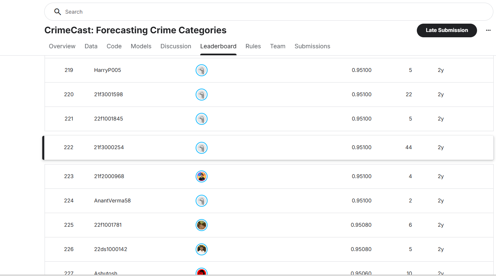
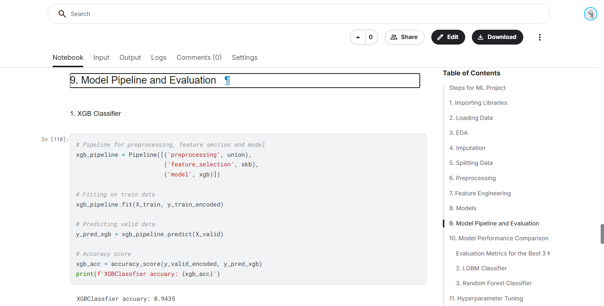

# CrimeCast: Forecasting Crime Categories

## Overview

CrimeCast is a machine learning project developed as part of the Kaggle competition **"Forecasting Crime Categories."**

The objective was to predict crime categories from historical crime records by combining structured features, textual information, feature engineering, and ensemble machine learning techniques.

The project follows a complete end-to-end machine learning workflow, including:

* Exploratory Data Analysis (EDA)
* Missing Value Treatment
* Feature Engineering
* Text Processing using TF-IDF
* Model Development
* Cross Validation
* Hyperparameter Tuning
* Model Evaluation
* Kaggle Submission Generation

---

## Competition Performance

🏆 **Kaggle Leaderboard Rank:** 222

📈 **Leaderboard Score:** 0.9510

---

## Problem Statement

Accurately forecasting crime categories can help authorities understand crime patterns, improve resource allocation, and support data-driven public safety strategies.

The task was formulated as a **multi-class classification problem**, where the goal was to predict the correct crime category for each incident.

---

## Dataset Features

The dataset contains historical crime records with information such as:

* Location details
* Cross streets
* Area information
* Victim demographics
* Weapon information
* Premise details
* Crime occurrence date and time
* Textual descriptions

Several features contained significant missing values and required preprocessing before model training.

---

## Project Workflow

### 1. Exploratory Data Analysis (EDA)

Performed detailed analysis of:

* Target class distribution
* Missing values
* Numerical feature distributions
* Categorical feature frequencies
* Crime occurrence trends
* Victim demographics
* Geographic attributes

Key observations included:

* Strong class imbalance in crime categories
* Large number of missing values in weapon-related fields
* Invalid values in victim age
* Location-based crime concentration patterns

---

### 2. Data Preprocessing

Implemented preprocessing pipelines for:

* Missing value imputation
* Numerical feature scaling
* Categorical feature encoding
* Text feature transformation
* Feature consolidation

---

### 3. Feature Engineering

Created a reusable machine learning pipeline that combines:

* Numerical features
* Categorical features
* Text-based features using TF-IDF
* Feature selection using SelectKBest

This approach reduced dimensionality while preserving predictive information.

---

### 4. Model Development

Evaluated multiple machine learning models:

#### Random Forest Classifier

* Ensemble tree-based model
* Strong baseline performance

#### LightGBM Classifier

* Gradient boosting framework
* Efficient training and strong predictive capability

#### XGBoost Classifier

* Gradient boosting algorithm
* Best overall performance across evaluation metrics

---

### 5. Model Evaluation

Used:

* Train/Validation Split
* Classification Reports
* Confusion Matrices
* Accuracy Comparison
* Macro-Average Metrics

Findings showed that XGBoost achieved the best balance between overall accuracy and minority-class performance.

---

### 6. Cross Validation

Applied:

* 5-Fold Cross Validation

to improve model robustness and reduce overfitting risk.

---

### 7. Hyperparameter Tuning

Performed GridSearchCV optimization for:

* Random Forest
* LightGBM
* XGBoost

Optimized parameters included:

* Number of estimators
* Learning rate
* Tree depth
* Number of leaves
* Split criteria

The final tuned XGBoost model achieved the strongest validation performance.

---

## Final Model

The final production pipeline consisted of:

* Data Preprocessing Pipeline
* TF-IDF Feature Extraction
* SelectKBest Feature Selection
* XGBoost Classifier

This model was trained on the full dataset and used to generate competition submissions.

---

## Technologies Used

### Programming Language

* Python

### Libraries

* Pandas
* NumPy
* Scikit-Learn
* XGBoost
* LightGBM
* Matplotlib
* Seaborn

### Machine Learning Techniques

* Multi-Class Classification
* Feature Engineering
* TF-IDF Vectorization
* SelectKBest Feature Selection
* Cross Validation
* Hyperparameter Tuning
* Ensemble Learning

---

## Repository Structure

```text
CrimeCast-Forecasting-Crime-Categories/
│
├── crimecast_notebook.ipynb
├── README.md
│
└── images/
    ├── leaderboard_rank.png
    └── model_pipeline.png
```

---

## Results

### Kaggle Leaderboard



Leaderboard Score: **0.9510**

Leaderboard Rank: **222**

### Model Pipeline



The project implements a complete machine learning workflow including preprocessing, feature engineering, model comparison, hyperparameter tuning, and final prediction generation.

---

## Key Learnings

Through this project, I gained practical experience in:

* End-to-end machine learning workflows
* Kaggle competition methodology
* Feature engineering techniques
* Text feature extraction using TF-IDF
* Ensemble learning methods
* Model evaluation and comparison
* Hyperparameter tuning with GridSearchCV
* Building reusable ML pipelines

---

## Author

**Akula Geetha Maheswari**

BSc in Data Science and Programming
Indian Institute of Technology Madras
